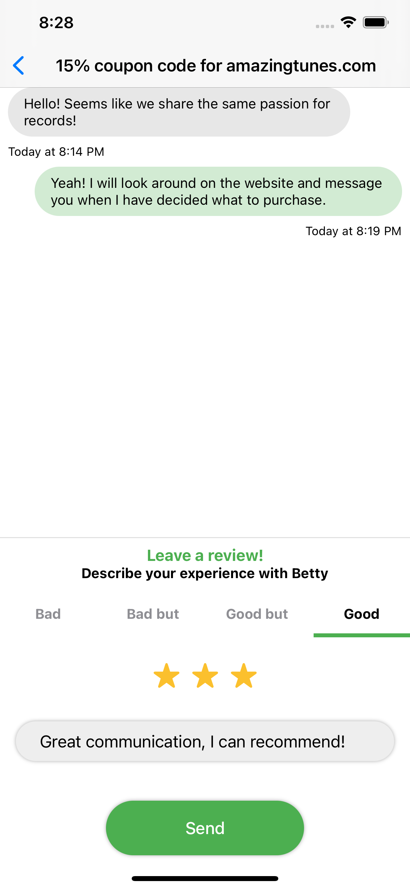

# ShipWithMe-ios

## Screen sizes to emulator

#### iPhone 6.5" Display
iPhone 11 Pro Max

#### iPhone 5.8" Display
iPhone 11 Pro

#### iPhone 5.5" Display
iPhone 8 Plus

### As published on the App Store

  <kbd>
    
  </kbd>
  <kbd>
    
  </kbd>

### Other screenshots

#### Create Post

  <kbd>
    
  </kbd>

#### Post Created

  <kbd>
    
  </kbd>

#### View Post

  <kbd>
    
  </kbd>

#### Chat

  <kbd>
    
  </kbd>

#### Create Review

  <kbd>
    
  </kbd>

#### Reviews

  <kbd>
    
  </kbd>

#### Account

  <kbd>
    
  </kbd>

